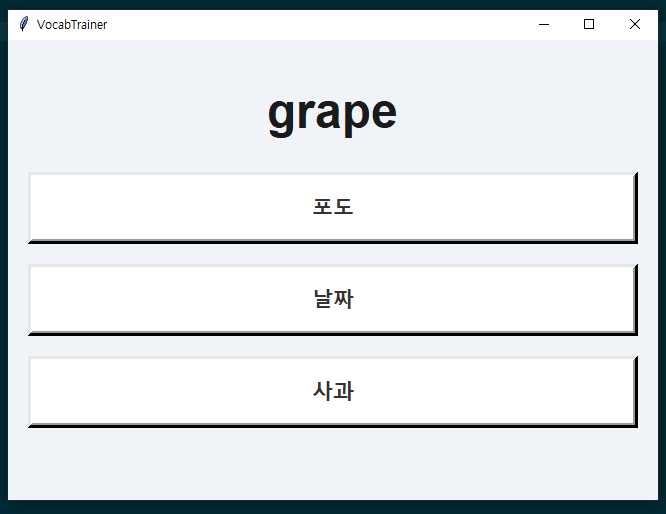

# VocabTrainer 📝

**영어 단어 학습 프로그램** – 영어 단어를 제시하고, 한국어 뜻을 **삼지선다 퀴즈** 형식으로 풀 수 있습니다.  
UI는 **Tkinter** 기반이며, 번역은 **Lingvanex Translation API**를 사용합니다.  
번역 결과는 **로컬 캐시(JSON 파일)**로 저장되어, 첫 실행 이후에는 빠르게 작동합니다.

---

## 🚀 주요 기능
- 🎲 영어 단어 랜덤 출제
- ✅ 한국어 뜻 3지선다 문제 (정답 1 + 오답 2)
- 🎨 정답 클릭 시 색상 피드백: 초록(정답), 빨강(오답)
- 💾 번역 캐싱 기능 (`translations.json`)  
  → 최초 실행 시만 API 호출, 이후 로컬에서 즉시 불러오기
- 🖥️ 심플한 카드형 UI (Tkinter)

---

## 📂 프로젝트 구조
| 파일 | 설명 |
|------|------|
| `main.py` | 메인 실행 파일 |
| `translations.json` | 번역 캐시 파일 (자동 생성) |
| `requirements.txt` | 필요 라이브러리 목록 |
| `setup.bat` | Windows 한방 설치 + 실행 |
| `setup.sh` | Linux/Mac 한방 설치 + 실행 |
| `README.md` | 프로젝트 설명 |

---

## 🛠️ 사용 라이브러리 & API

### Python 표준 라이브러리
- `tkinter` → UI (윈도우, 버튼, 레이블 등)
- `random` → 무작위 단어, 보기 셔플
- `json` → 로컬 캐시 저장/불러오기
- `os` → 캐시 파일 존재 여부 확인

### 외부 라이브러리
- `requests` → Lingvanex API 요청

### 사용 API
- **Lingvanex B2B Translation API**
  - 공식 문서: [https://lingvanex.com](https://lingvanex.com)
  - 역할: 영어 단어 → 한국어 번역
  - 응답 구조: `{ "err": null, "result": "번역된 단어" }`

---

## ⚙️ 설치 및 실행

### 1️⃣ 저장소 클론
```bash
git clone https://github.com/your-username/VocabTrainer.git
cd VocabTrainer
```

---

