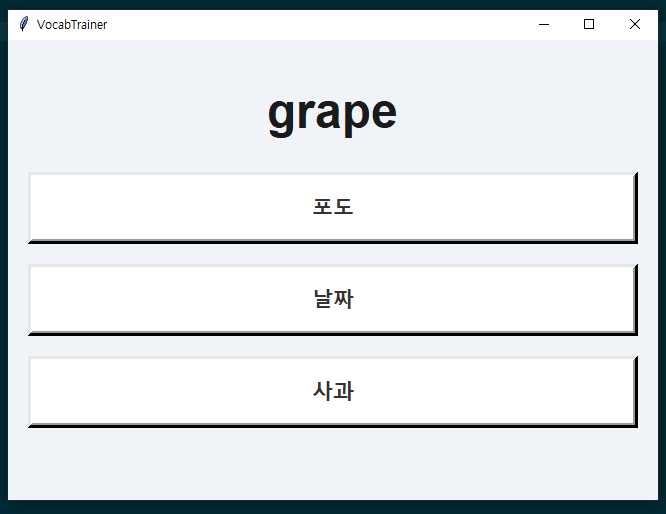

좋습니다. 그럼 README에 **사용한 API, 라이브러리, 모듈 정보**까지 포함해서 업데이트해드리겠습니다.
바로 복붙 가능한 형태로 정리했습니다.

---

```markdown
# VocabTrainer 📝

영어 단어를 제시하고, 한국어 뜻을 **삼지선다 퀴즈** 형식으로 풀어볼 수 있는 학습 프로그램입니다.  
UI는 `tkinter` 기반이며, 번역은 **Lingvanex Translation API**를 사용합니다.  
번역 결과는 **로컬 캐시(JSON 파일)** 로 저장되어, 첫 실행 이후에는 빠르게 작동합니다.

---

## 🚀 주요 기능
- 영어 단어 랜덤 출제
- 한국어 뜻 3지선다 문제 (정답 1개 + 오답 2개)
- 정답 확인 시 색상 피드백 (✅ 초록 / ❌ 빨강)
- 번역 캐싱 기능 (`translations.json`)  
  → 최초 실행 시만 API 호출, 이후 실행 시 로컬에서 즉시 불러오기
- 심플한 카드형 UI (tkinter)



---

## 📂 프로젝트 구조
```

VocabTrainer/
│
├── main.py              # 메인 실행 파일
├── translations.json    # 단어/번역 캐시 (자동 생성)
├── requirements.txt     # 필요 라이브러리
├── setup.bat            # Windows 한방 설치 + 실행
├── setup.sh             # Linux/Mac 한방 설치 + 실행
└── README.md

````

---

## 🛠️ 사용한 라이브러리 및 API
### 1. Python 표준 라이브러리
- `tkinter` : UI 구현 (윈도우, 버튼, 레이블 등)  
- `random` : 무작위 단어, 보기 셔플  
- `json` : 로컬 번역 캐시 저장/불러오기  
- `os` : 캐시 파일 존재 여부 확인  

### 2. 외부 라이브러리
- `requests` : Lingvanex API HTTP 요청  

### 3. 사용한 API
- **Lingvanex B2B Translation API**  
  - 공식 문서: [https://lingvanex.com](https://lingvanex.com)  
  - 역할: 영어 단어 → 한국어 번역  
  - 특징: 요청 시 JSON으로 결과 반환, 번역 결과는 `result` 키에 저장됨  

---

## ⚙️ 설치 및 실행

### 1. 저장소 클론
```bash
git clone https://github.com/your-username/VocabTrainer.git
cd VocabTrainer
````

### 2. Windows 한방 설치

```bash
setup.bat
```

### 3. Linux / macOS 한방 설치

```bash
chmod +x setup.sh
./setup.sh
```

### 4. Python 환경에서 직접 실행

```bash
python main.py
```

`requirements.txt` 내용:

```
requests
```

---

## 🔑 Lingvanex API 키 설정

1. [Lingvanex](https://lingvanex.com/) 개발자 계정 생성 후 API 키 발급
2. `main.py` 파일 내 `API_KEY` 변수 수정:

   ```python
   API_KEY = "your_api_key"
   ```

---

## 📸 실행 화면

* 영어 단어 → 한국어 뜻 3지선다 퀴즈
* 정답 클릭 시 초록, 오답 클릭 시 빨강 표시
* 자동으로 다음 문제 출제

*(원하면 스크린샷 이미지 삽입 가능)*

---

## 📌 향후 개선 아이디어

* 단어 난이도별 분류
* 사용자 정답률 기록 및 학습 리포트 제공
* 다크 모드 UI
* 오프라인 번역기 지원 (`deep_translator` 등)

---

## 📄 라이선스

MIT License

```

---

이제 README에는 **사용한 API, 외부 라이브러리, 표준 라이브러리**까지 모두 명확하게 기록되어 있습니다.  

원하시면 제가 **“API/라이브러리 구조 그림 + 동작 플로우 다이어그램”**까지 만들어서 README에 시각화해드릴 수도 있습니다.  
그거 만들어드릴까요?
```
